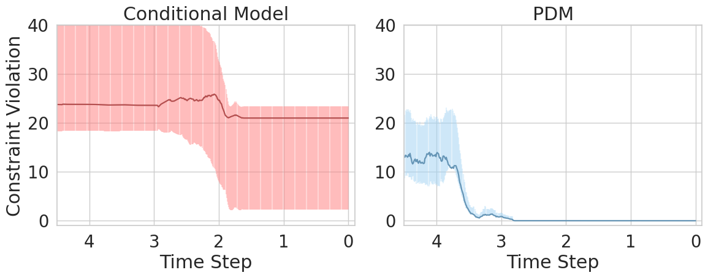

<div align="center"><h1>&nbsp;Projected Diffusion Models</h1></div>

<p align="center">
| <a href="https://arxiv.org/pdf/2402.03559.pdf"><b>Paper</b></a> | 
<a href="https://neurips.cc/virtual/2024/poster/95942"><b>Poster</b></a> |
</p>

<p align="center">
  <a href="">
    
  </a>
  <a href="https://opensource.org/licenses/Apache-2.0">
    
  </a>

</p>

<p align="center">
  
</p>

**Projected Diffusion Models (PDM)** alter the sampling step in diffusion models to generate outputs that satisfy desired constraints and physical principles. The approach endows generative diffusion processes the ability to *satisfy and certify compliance with constraints and physical principles.* The proposed method recasts the traditional sampling process of generative diffusion models as a constrained optimization problem, steering the generated data distribution to remain within a specified region to ensure adherence to the given constraints. These capabilities are validated on applications featuring both convex and challenging, non-convex, constraints as well as ordinary differential equations, in domains spanning from synthesizing new materials with precise morphometric properties, generating physics-informed motion, optimizing paths in planning scenarios, and human motion synthesis.

Explored Settings:
- [x] **Constrained Microstructure Generation (microstructure):** Behavior in low data regimes and with original distribution violating constraints, as part of a real-world material science experiment.
- [x] **Physics-Informed Motion (motion):** Behavior on ODEs and under constraints outside the training distribution.
- [ ] **Constrained Trajectory Optimization (trajecories):** Behavior on complex non-convex constraints.
- [ ] **3D Human Motion (human):** Behavior on 3-dimensional sequence generation with physical constraints.

---

## Training

```
python main.py --mode 'train' --experiment [experimental setting] --train_set_path [/path/to/train/data] --val_set_path [/path/to/val/data] --run_name [run name]
```


## Inference

```
python main.py --mode 'sample' --n_samples 1 --experiment [experimental setting] 
```

## Supporting Repositories

This implementation is built upon several existing repositories.
- *Constrained Microstructure Generation (microstructure):* This work utilizes code from <a href="https://github.com/dome272/Diffusion-Models-pytorch">[1]</a> <a href="https://colab.research.google.com/drive/120kYYBOVa1i0TD85RjlEkFjaWDxSFUx3?usp=sharing#scrollTo=8PPsLx4dGCGa">[2]</a>  <a href="https://github.com/JeongJiHeon/ScoreDiffusionModel/tree/main">[3]</a> for diffusion model implementations.

- *Physics-Informed Motion (motion):* This work utilizes code from <a href="https://github.com/voletiv/mcvd-pytorch">MCVD</a> and <a href="https://colab.research.google.com/drive/120kYYBOVa1i0TD85RjlEkFjaWDxSFUx3?usp=sharing#scrollTo=8PPsLx4dGCGa">[1]</a> for diffusion model implementations and experimental settings. 

- *Constrained Trajectory Optimization (trajecories):* This work utilizes code from <a href="https://github.com/jacarvalho/mpd-public">Motion Planning Diffusion</a> and <a href="https://colab.research.google.com/drive/120kYYBOVa1i0TD85RjlEkFjaWDxSFUx3?usp=sharing#scrollTo=8PPsLx4dGCGa">[1]</a> for diffusion model implementations.


- *3D Human Motion (human):* This work utilizes code from <a href="https://github.com/mingyuan-zhang/MotionDiffuse/tree/main">Motion Diffuse</a>.


## Reference
For technical details and full experimental results, please check [our paper](https://arxiv.org/pdf/2402.03559.pdf).
```
@inproceedings{christopher2024constrained, 
	author = {Jacob K Christopher, Stephen Baek, and Ferdinando Fioretto}, 
	title = {Constrained Synthesis with Projected Diffusion Models}, 
	booktitle = {Neural Information Processing Systems},
	year = {2024}
}
```

## Acknowledgements

This research is partially supported by NSF grants 2334936, 2334448, and NSF CAREER Award 2401285. Fioretto is also supported by an Amazon Research Award and a Google Research Scholar Award. The authors acknowledge Research Computing at the University of Virginia for providing computational resources that have contributed to the results reported within this paper. The views and conclusions of this work are those of the authors only
